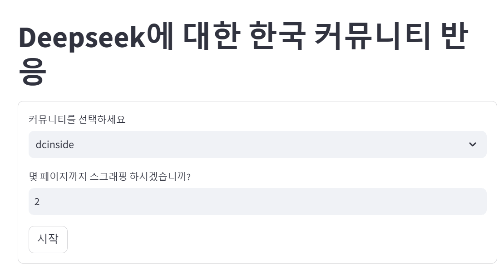
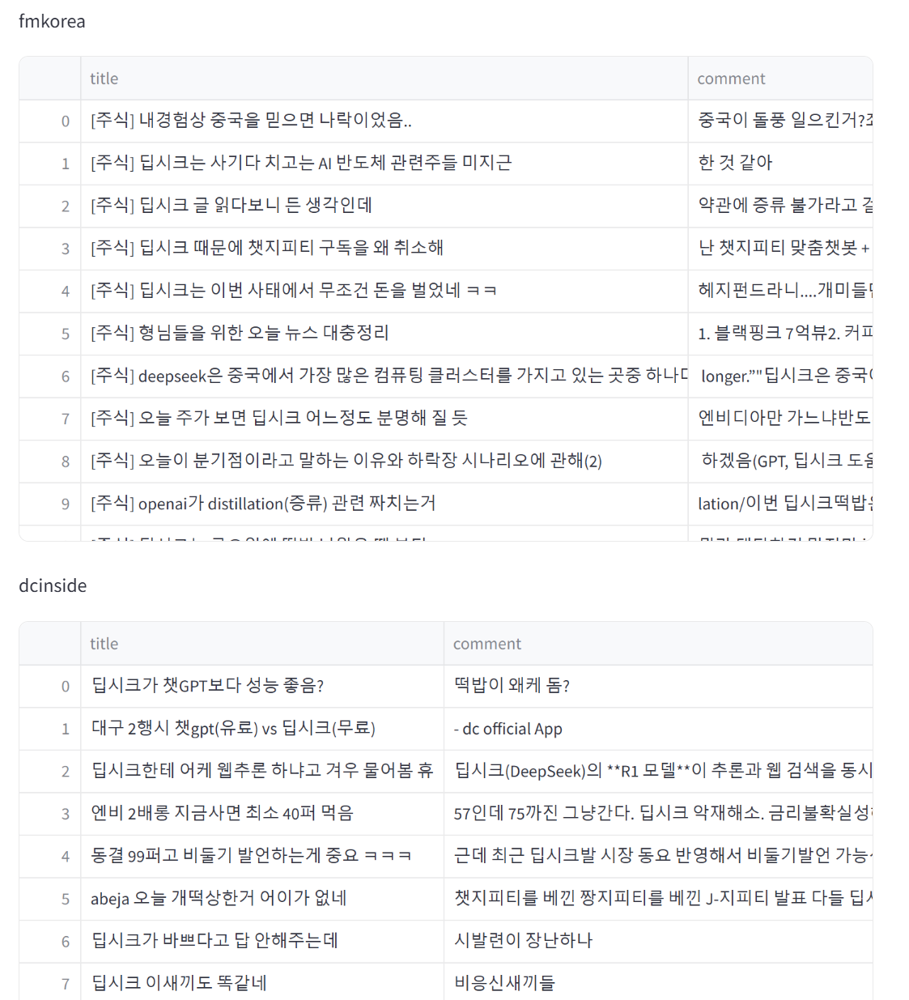

# scraping-comments-for-deepseek-in-korean-community

<br>

## 프로젝트 개요

### 프로젝트 주제

한국 커뮤니티에서 DeepSeek에 대한 반응 스크래핑

### 프로젝트 목적

최근 중국에서 개발된 AI 모델 DeepSeek는 다른 모델에 비해 약 10분의 1 정도의 개발비와 저성능 GPU 칩을 사용하면서도 OpenAI 모델과 비슷한 성능을 자랑한다. 또한, DeepSeek는 오픈소스로 제공되어 세간의 뜨거운 관심을 받고있다.

DeepSeek의 등장으로 인해 주식시장에는 큰 충격이 발생했다. 경제적 효율성과 성능이 뛰어난 AI 모델이 저비용으로 개발되면서 기존의 AI 산업 및 관련 주식에 큰 변화를 초래한 것이다. 또한, 인터넷 이용자들 사이에서는 DeepSeek가 밈화되어 다양한 반응을 이끌어내고 있다.

DeepSeek에 대한 한국 커뮤니티의 반응을 분석하여 사람들의 동향을 파악하고 인사이트를 도출하는 것이다. 이를 통해 DeepSeek의 시장 반응과 사용자들의 기대를 이해하고, 향후 기술 개발 및 시장 전략에 필요한 중요한 정보를 얻을 수 있을 것이다.

### 프로젝트 내용

한국의 최대 커뮤니티 디시인사이드, FM코리아아에서 '딥시크'를 검색하여 관련글 제목과 내용을 스크래핑 후 MySQL 데이터베이스에 저장.

<br>

## 기술스택

### 데이터 저장 및 처리

 &nbsp;  &nbsp; 

### 화면 구현

 &nbsp; 

### 버전 관리

 &nbsp; 

<br>

## 설치/사용 방법

### 1. Github에서 Repository Clone

``` python
git clone https://github.com/yuuunong/scraping-comments-for-deepseek-in-korean-community.git
```

### 2. 라이브러리 설치
``` python
pip install -r requirements.txt
```

### 3. 데이터베이스 구축

Docker로 MySQL서버 설치
``` python
cd mysql
docker-compose up -d
cd ..
```

SQL IDE에서 MySQL서버 루트계정으로 접속 후 테이블 생성 (.streamlit\secrets.toml 참고)
``` MySQL
USE scraping_comments_for_deepseek;

CREATE TABLE comments_fmkorea(
	title VARCHAR(250),
	comment VARCHAR(250),
	gallery VARCHAR(50),
	date_ DATE
	)
;

CREATE TABLE comments_dcinside(
	title VARCHAR(250),
	comment VARCHAR(250),
	gallery VARCHAR(50),
	date_ DATE
	)
;
```

### 4. 서비스 실행
``` python
streamlit run app.py
```

<br>

## 프로젝트 결과



## 개발하면서 발생한 문제

### sqlalchemy.exc.ResourceClosedError: This result object does not return rows. It has been closed automatically.

streamlit.connection.query에서 sql파라미터에 insert문을 삽입해서 발생한 문제. query에서는 select문만 사용해야 한다.

#### 해결방법

streamlit.connection.session.execute(insert문), streamlit.connection.session.commit()을 사용한다.

### sqlalchemy.exc.ArgumentError: Textual SQL expression '' should be explicitly declared as text('')

streamlit connection을 생성하고 connection에서 insert 쿼리문을 실행하려고 할 때 발생한 문제. 데이터에 따옴표( ' or " )가 있으면 쿼리 문자열을 제대로 인식하지 못하고 MySQL서버에 저장하지 못함

#### 해결방법

sqlalchemy 라이브러리에서 text함수를 import하고 해당 쿼리 str을 text함수에 넣어서 해결

